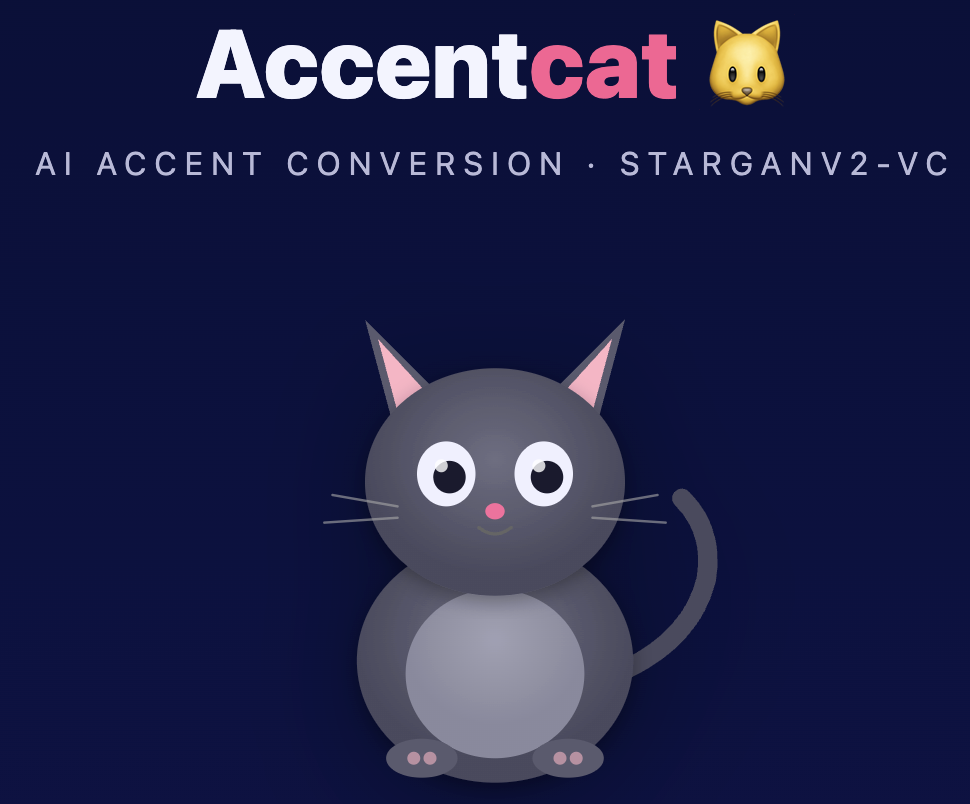
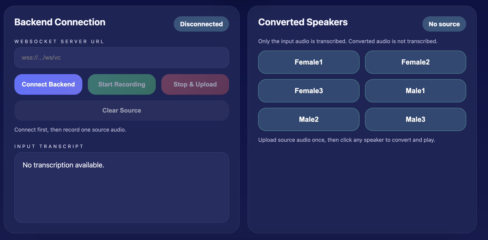

# Accent Conversion Project

## Overview
This project implements accent and voice-style conversion using a StarGANv2-VC based pipeline. It reads Mel spectrograms from source speech, combines speaker style and F0 features, and generates converted waveform outputs with a ParallelWaveGAN vocoder.

## Key points
- Core model is trained on the VCTK corpus for multi-speaker accent conversion.
- Additional models were trained on non-native speaker datasets and on multiple female voice datasets.
- Supports both reference-based style transfer and speaker-domain conversion.
- Supports swap-in of different checkpoints for model comparison and new voice-style experiments.

## Structure
```
Accent-Conversion-main/
├─ Configs/
│   └─ config.yml                # training and model settings
├─ Data/
│   └─ VCTK2019/
│       ├─ train_list.txt        # train audio list
│       ├─ val_list.txt          # validation audio list
│       └─ VCTK.ipynb            # dataset preparation notebook
├─ src/
│   ├─ train.py                  # training entry point
│   ├─ models.py                 # StarGANv2-VC model definitions
│   ├─ trainer.py                # training loop and loss logic
│   └─ inference.py              # inference helper script
├─ Demo/
│   └─ Demo.ipynb                # demo notebook
├─ UI/
│   └─ Accent_Cat.html           # web frontend demo page
└─ Utils/
    ├─ ASR/
    │   ├─ config.yml
    │   └─ epoch_00100.pth        # pretrained ASR model
    └─ JDC/
        └─ bst.t7                # pretrained F0 model
```
## Requirements
GPU is recommended.

- Python 3.7 / 3.8 / 3.9
- `torch`, `torchaudio`
- `soundfile`, `librosa`, `pydub`
- `munch`, `pyyaml`, `click`
- `parallel_wavegan`
- `scipy`, `numpy`
- `fastapi`, `uvicorn`, `websockets` (optional for web demo)


## Data
Option 1: use the official VCTK download:
`https://datashare.ed.ac.uk/handle/10283/3443`

Option 2: use the provided Google Drive processed dataset:
`https://drive.google.com/drive/folders/10HssOiVUJHytKAyZYtAAZiXEMNGedAzs?usp=sharing`

The current project expects:
- `Data/VCTK2019/train_list.txt`
- `Data/VCTK2019/val_list.txt`

List format:
```
/path/to/audio.wav|speaker_id
```

## Training
Run from the project root:
```bash
python src/train.py --config_path Configs/config.yml
```


## Inference
Run from the project root:

Example command:
```bash
python inference.py \
  --source Data/VCTK2019/p228/p228_023.wav \
  --reference_paths Data/VCTK2019/p230/p230_023.wav Data/VCTK2019/p233/p233_023.wav \
  --output_dir Demo/converted
```

If you want to run inference by speaker domain without a reference file, pass `--speaker_ids`:
```bash
python inference.py \
  --source Data/VCTK2019/p228/p228_023.wav \
  --speaker_ids 233 \
  --output_dir Demo/converted
```

The script uses the default paths below unless overridden:
- `Models/VCTK2019/config.yml`
- `Models/VCTK2019/epoch_00150.pth`
- `Vocoder/checkpoint-400000steps.pkl`
- `Utils/JDC/bst.t7`

A notebook example call has been added to `Train.ipynb`.

## How to run the demo
1. git clone the repo and open `Demo/Demo.ipynb`.
2. Place the processed dataset under `Data/VCTK2019/` and put pretrained files in the matching locations:
   - `Models/VCTK2019/config.yml`
   - `Models/VCTK2019/epoch_00150.pth`
3. Open the notebook in Colab or Jupyter and run the demo cells.





## Pretrained models
Download pretrained model checkpoints from the provided Google Drive link：
`https://drive.google.com/drive/folders/1pWxOa8DuGW0_4g8a5g9bTnaOljHA-KzE?usp=sharing`

Expected files:
- `Models/VCTK2019/epoch_00150.pth`
- `Models/VCTK2019/config.yml`

## References
- `clovaai/stargan-v2`
- `kan-bayashi/ParallelWaveGAN`
- `tosaka-m/japanese_realtime_tts`
- `keums/melodyExtraction_JDC`
